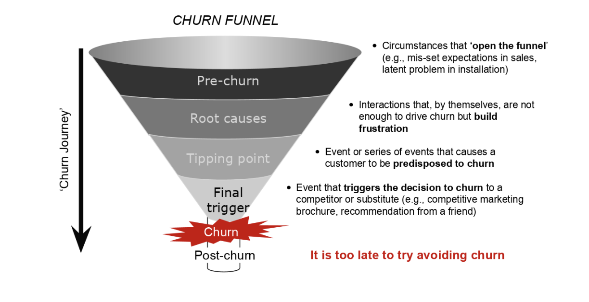
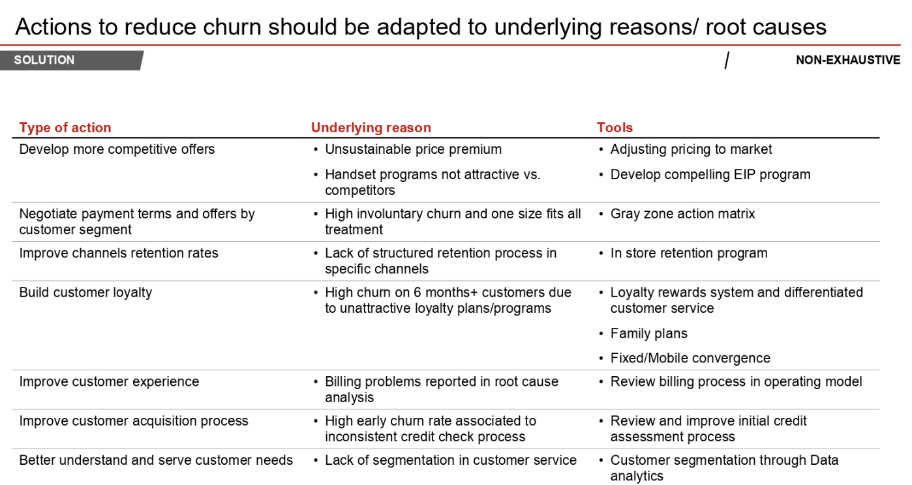
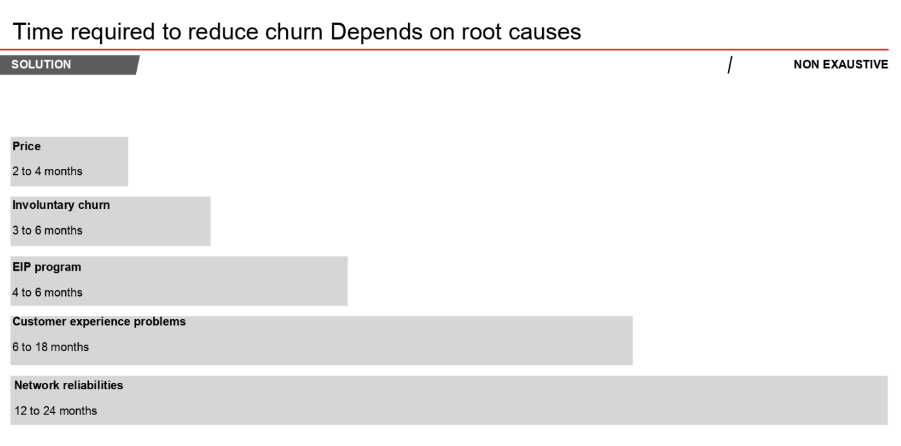

# Churn Case Study

## Context
"Predict behavior to retain customers. You can analyze all relevant customer data and develop focused customer retention programs." [IBM Sample Data Sets]

**Client**: Telco Company in the USA offering triple play (Phone, internet and TV)

New competitor entered offering triple play, resulting in increased churn

Want better way to spot potential churning customers and suggested actions what to do

**Assignment**:

- determine which type slice/segment/type of churn you are interested in
- create a logistic regression to understand the coefficients
- use more advanced models to predict churn
- Using those models identify the drivers of churn in your segment analysis and make recommendations for the company

### Plan

#### Sprint #1: Explore data and ask questions **2 hours**
1. Load the necessary libraries

2. Load the data

3. Explore data – what types, any obvious issues

4. Run mechanical feature engineering (longest part)

5. Split data

6. Run logistic regression

7. Explore coefficients

8. Deep dive on the most predictive data

9. Clean-up data (if needed)

10. Re-run logistic regression (if needed)

#### Sprint #2: Data Engineering and Sophisticated model building, including suggested actions **1.5 hours**
1. Choose if accuracy or a different metric would be the best metric given this problem. Must be a number and not a confusion matrix.

2. Run XGboost, SVM, Random Forest, AdaBoodst and GradientBoost and compare their performance and feature importance (where relevant)

3. Pick 2 features to engineer & feature engineer each feature &
explore whether feature has sufficient signal

4. Add features with signal into clean & feature engineered data

5. Re-run models with added features then **PICK** one model

6. Hyper-parameter tune

7. Deliver report with recommendations for the business based on model output


### Concepts:

#### Type of churn:

**Voluntary** – they left after contract was up

**Involuntary** – we fired them

**Early churn** – left early, broke contract

##### Churn is a survival problem:
- Predicting who will churn next month is really hard
- Predicting who may churn over next 3 months is easier

There are many reasons to churn -> **feature engineering is king**







### Data
```
url_link = 'https://docs.google.com/spreadsheets/d/1TAWfdKnWYiCzKUeDyGL6NzIOv7AxFt_Sfzzax464_FQ/export?format=csv&gid=882919979'

telco = pd.read_csv(url_link)
```

Each row represents a customer, each column contains customer’s attributes described on the column Metadata.

The data set includes information about:

- Customers who left within the last month – the column is called Churn
- Services that each customer has signed up for – phone, multiple lines, internet, online security, online backup, device protection, tech support, and streaming TV and movies
- Customer account information – how long they’ve been a customer, contract, payment method, paperless billing, monthly charges, and total charges
- Demographic info about customers – gender, age range, and if they have partners and dependents
- Usage - information about their usage patterns
